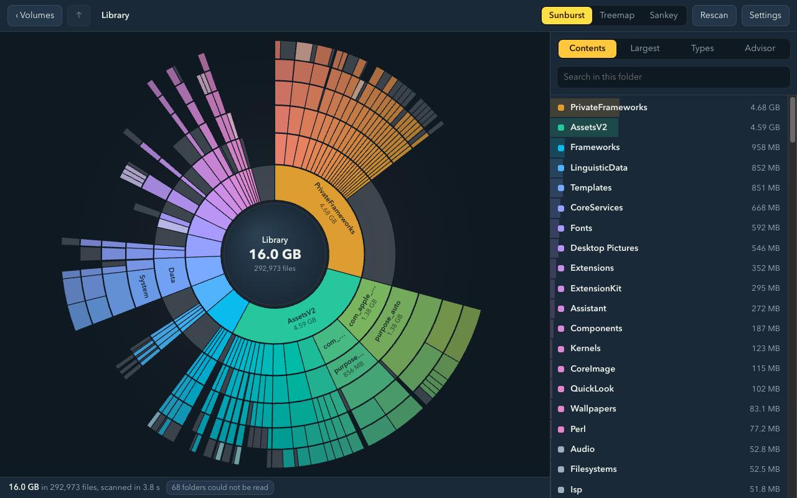
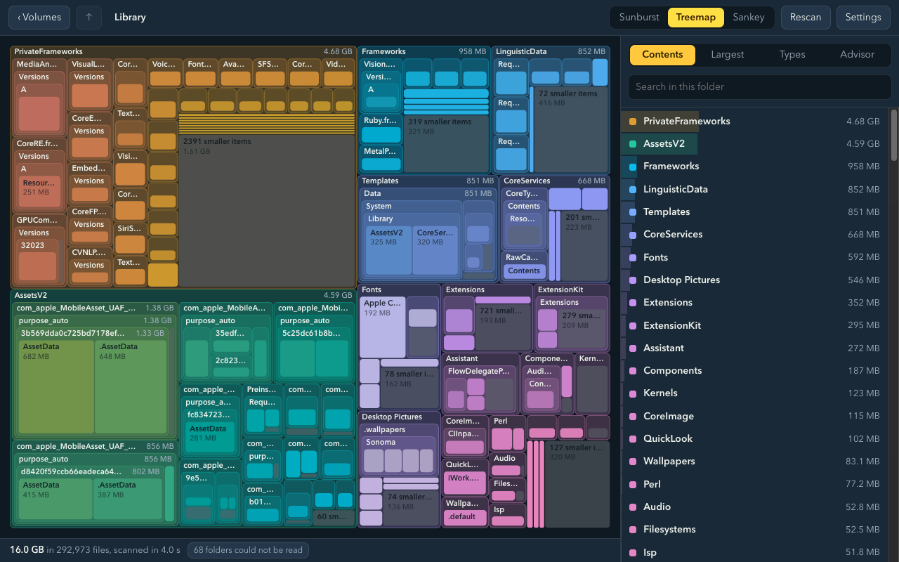
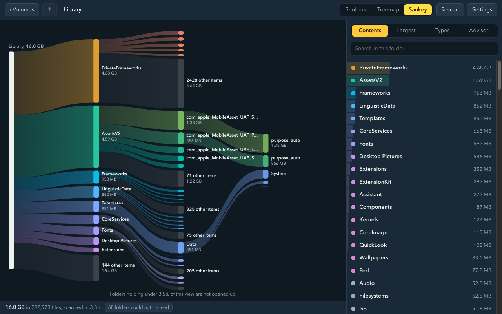
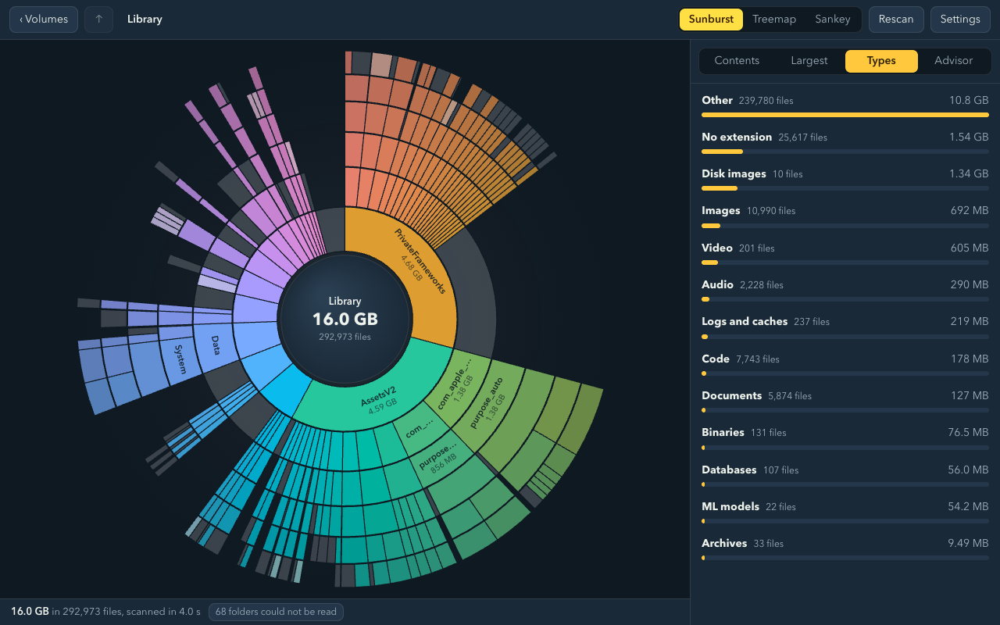

# FrisyDisk

[](https://github.com/agentic-work/frisydisk/actions/workflows/ci.yml)
[](https://github.com/agentic-work/frisydisk/actions/workflows/release.yml)
[](https://github.com/agentic-work/frisydisk/releases/latest)
[](LICENSE)

See what is using your disks, on macOS and Windows. One Rust scanner, one web
interface, packaged with Tauri.



| Treemap | Sankey (largest folders only) | File types |
| --- | --- | --- |
|  |  |  |

## What it does

- Scans a volume or folder in parallel and draws the chart while it scans.
- Three views of the same data: sunburst, treemap, and a Sankey flow that opens
  up only the largest folders.
- A synced list, search, a largest-files list and a file-type breakdown for
  whatever folder you are in.
- Hidden space: when you scan a whole volume, the space it uses that no scan can
  see (swap, snapshots, purgeable space, system volumes, folders you cannot read)
  shows as its own striped slice, broken down where the system reports it.
- Collector: stage items, review them, then move them to the Trash (Recycle Bin
  on Windows) after a confirmation.
- Clean up: temporary files, app caches, logs, developer caches and build folders
  (node_modules, target and the like) in projects untouched for 90 days. You pick
  the categories and choose Move to Trash or Delete permanently. Anything changed
  in the last hour (temporary files: the last day) is left alone, links are never
  followed, and nothing outside those folders can be touched.
- Advisor: sends the scan and a summary of your volumes, including NAS shares,
  to a model and asks for non-destructive ways to improve I/O and use existing
  storage better. It only produces text, and any command in an answer that
  would delete data is flagged.

### Advisor providers

The Advisor tab appears only when there is a model to talk to. Under
**Settings** you can use any of:

| Provider | What to set | Where your scan summary goes |
| --- | --- | --- |
| Ollama on this computer | nothing, it is detected at `127.0.0.1:11434` | nowhere, it stays local |
| Ollama on another machine | its address | that machine |
| AgenticWork | base URL and API key | your AgenticWork deployment |
| Anthropic | API key | Anthropic |
| OpenAI | API key | OpenAI |

With nothing configured and no local Ollama, the tab stays hidden. You can also
turn the advisor off. Keys are stored in `settings.json` in your user config
folder (readable only by you on macOS and Linux) and are never sent to the
interface.

## Terminal app

`frisy` shows the same thing in a terminal, on macOS, Linux and Windows
(PowerShell or Command Prompt). It uses the same fast scanner as the app.

```sh
# macOS and Linux
curl -fsSL https://raw.githubusercontent.com/agentic-work/frisydisk/main/scripts/install.sh | sh
```

```powershell
# Windows
irm https://raw.githubusercontent.com/agentic-work/frisydisk/main/scripts/install.ps1 | iex
```

```sh
frisy ~              # explore: arrows move, enter opens, backspace goes up, tab switches view
frisy clean          # temp files, caches, logs and unused build folders
frisy du -c ~/*      # like du -sch, much faster
frisy --print /      # largest items, as plain text
```

The interactive view needs Node.js 18 or newer; without it `frisy` prints a
summary. To see folders only an administrator can read, run it with `sudo`, or
from PowerShell opened as Administrator.

On this author's Mac, `frisy du` totalled a 69 GB folder in about a minute where
`du -sch` took six and a half.

## Build

You need Rust, Node 20 or later, and the platform tools Tauri asks for
(Xcode Command Line Tools on macOS; the MSVC build tools and WebView2 on Windows).

```sh
npm ci
npm test            # Rust core tests and the layout tests
npx tauri dev       # run the app from source
npx tauri build     # build an installer for this platform
```

## Layout

| Path | What is there |
| --- | --- |
| `crates/frisy-core` | Scanner, tree, analysis, advisor and the JSON API. No UI. |
| `crates/frisy-core/src/bin/frisyscan.rs` | Command-line scanner and development server. |
| `ui/` | The interface: plain HTML, CSS and JavaScript modules, no bundler. |
| `cli/` | The terminal app, built with Ink and bundled into one file. |
| `src-tauri/` | The desktop shell. It forwards one `api` command to the core. |
| `scripts/` | Icon drawing and the signed macOS release. |

## Command line

```sh
cargo run --release --bin frisyscan -- ~/Projects --top 20   # totals and largest children
cargo run --release --bin frisyscan -- --facts               # what the advisor is told about this machine
cargo run --release --bin frisyscan -- ~ --advise            # scan, then ask the first available model
cargo run --release --bin frisyscan -- ~ --advise anthropic  # or name a provider or a model
cargo run --release --bin frisyscan -- serve                 # the UI in a browser at http://127.0.0.1:7878
```

`serve` exposes the same API the app uses, bound to localhost only, so the
interface can be developed and tested in an ordinary browser.
`?scan=/path&mode=sankey&tab=types` in the URL, or `--scan PATH --mode sankey
--tab types` on the app's command line, opens straight into a scan.

## Download

Installers are on the [Releases](https://github.com/agentic-work/frisydisk/releases) page:
a `-setup.exe` for Windows and a universal `.dmg` for macOS.

- Windows: release builds are signed through Azure Artifact Signing when the
  repository has the Azure secrets; a build without them is unsigned and
  SmartScreen shows "Windows protected your PC" (**More info**, then **Run anyway**).
- macOS: if the build is not notarised, right-click the app and choose **Open**
  the first time.

## Cutting a release

```sh
# bump "version" in src-tauri/tauri.conf.json, Cargo.toml and package.json, then:
git tag v0.2.0 && git push origin v0.2.0
```

`.github/workflows/release.yml` builds both installers on GitHub's runners and
attaches them to a draft release; publish the draft when it looks right. To have
the macOS build Developer ID signed and notarised in CI, add these repository
secrets: `APPLE_CERTIFICATE` (base64 of the .p12), `APPLE_CERTIFICATE_PASSWORD`,
`APPLE_SIGNING_IDENTITY`, `APPLE_API_ISSUER`, `APPLE_API_KEY` (the key id) and
`APPLE_API_KEY_P8` (the contents of the .p8 file).

For Windows signing, add secrets `AZURE_TENANT_ID`, `AZURE_CLIENT_ID` and
`AZURE_CLIENT_SECRET` for a service principal holding the *Artifact Signing
Certificate Profile Signer* role on your certificate profile, and variables
`AZURE_SIGNING_ENDPOINT`, `AZURE_SIGNING_ACCOUNT` and `AZURE_SIGNING_PROFILE`.

## Signed macOS release, built locally

```sh
scripts/release-macos.sh install
```

Builds the app, signs it with a Developer ID certificate (hardened runtime,
secure timestamp), notarises and staples it, and wraps it in a signed,
notarised DMG. The header of the script lists the credentials it expects.

## What the numbers mean

- macOS and Linux: bytes allocated on disk; hard links are counted once.
  APFS clones are counted at full size each, as `du` does.
- Windows: logical file sizes; files that exist only in the cloud (OneDrive
  placeholders) count as zero. Junctions and symlinks are not followed.
- A whole-disk total is lower than the system's "used" figure: snapshots, swap
  and folders the app cannot read are not in it. On macOS, grant Full Disk
  Access to see protected folders.

## Contributing

Issues and pull requests are welcome; see [CONTRIBUTING.md](CONTRIBUTING.md).
Report security problems privately, as described in [SECURITY.md](SECURITY.md).

## Licence

MIT. See [LICENSE](LICENSE).
